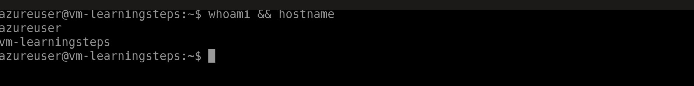
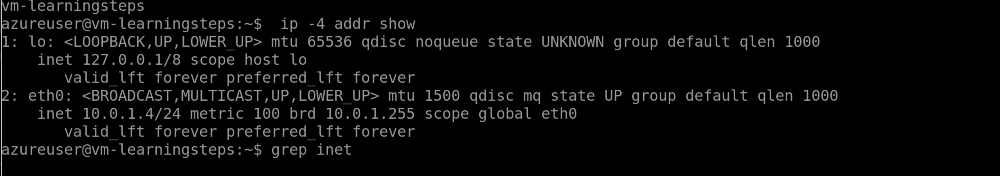
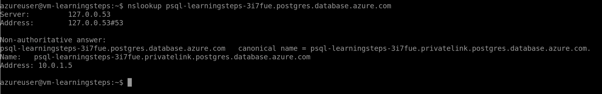

# 🔐 LearningSteps – Secure Azure Private Architecture (Terraform)

This project demonstrates how to design and deploy a secure, production-style Azure infrastructure using Terraform, following Zero Trust networking principles.

Unlike a basic deployment, this architecture ensures that both the virtual machine and PostgreSQL database are completely private and not exposed to the public internet.

---

## 🚀 Architecture Overview

The infrastructure consists of:

* Azure Virtual Network (VNet)
* Subnet with Network Security Group (NSG)
* Linux Virtual Machine (no public IP)
* Azure Bastion for secure SSH access
* PostgreSQL Flexible Server (public access disabled)
* Private Endpoint for database connectivity
* Private DNS Zone for internal name resolution

---

## 🔐 Security Features

* No public IP on the virtual machine (enforced via Azure Policy)
* SSH access only through Azure Bastion
* PostgreSQL database is not publicly accessible
* Private Endpoint ensures database traffic stays inside the VNet
* Private DNS resolves the database hostname to a private IP (10.x.x.x)
* Least-privilege network rules via NSG

---

## 🧪 Validation (Proof of Private Connectivity)

Inside the VM:

```bash
nslookup psql-learningsteps-3i7fue.postgres.database.azure.com
```

Result:

```
Address: 10.0.1.5
```

This confirms that all database communication flows through the private network and not the public internet.

---

## 📸 Screenshots

### 🔐 VM Access (via Bastion)



### 🌐 Private IP Address



### 🔥 Private DNS Resolution (Key Proof)



---

## 🛠️ Technologies Used

* Terraform (Infrastructure as Code)
* Microsoft Azure
* Azure CLI
* Linux (Ubuntu)

---

## 🧠 Key Learnings

* Designing secure cloud infrastructure using Terraform
* Implementing Zero Trust architecture in Azure
* Configuring and troubleshooting Private Endpoints
* Debugging Private DNS resolution issues
* Working with Azure Policy restrictions (e.g., no public IP)
* Securing database access without internet exposure

---

## 📘 Project Context

This project was completed as part of a structured cybersecurity and cloud training program.

The initial deployment was intentionally insecure (public VM, open database access). It was then redesigned and hardened into a secure architecture using private networking and Zero Trust principles.

---

## ⚠️ Security Note

Sensitive files such as Terraform state files, SSH keys, and credentials are excluded from this repository using `.gitignore`.

---

## 👤 Author

Kwabena
